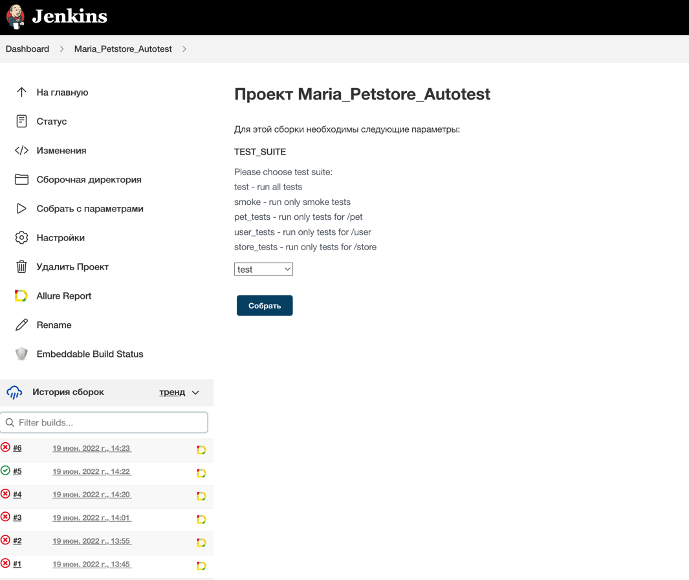

# Проект по автоматизации API-тестов Petstore

:dog2: <a href="https://petstore.swagger.io/">Petstore</a> - приложение для практики REST-запросов. Этот сайт имитирует онлайн-зоомагазин, в котором можно работать с информацией о питомцах, заказах и пользователях.

## :computer: Технологический стек

> Автотесты написаны на <code>Java</code>. 
> Для автоматизированной сборки проекта используется <code>Gradle</code>.
> В качестве библиотеки для тестирования используется <code>JUnit 5</code>.
> API-запросы реализованы с помощью <code>REST-assured</code> и <code>Lombok</code>.
> Отчеты о тестировании формирует <code>Allure Report</code>.
> Тесты можно запускать в <code>Jenkins</code>.

## :clipboard: Реализованные проверки
- Питомцы:
  - Получение питомца по id <code>GET /pet/{id}</code>
  - Получение питомцев по статусу <code>GET /pet/findByStatus?status={status}</code>
  - Создание питомца <code>POST /pet</code>
  - Удаление питомца <code>DELETE /pet/{id}</code>
- Пользователи:
  - Получение пользователя по нику <code>GET /user/{username}</code>
  - Создание пользователя <code>POST /user</code>
  - Создание пользователей из массива <code>POST /user/createWithArray</code>
  - Редактирование пользователя <code>PUT /user/{username}</code>
  - Удаление пользователя <code>DELETE /user/{username}</code>
- Магазин:
  - Получение заказа по id <code>GET /store/order/{orderId}</code>
  - Создание заказа <code>POST /store/order</code>
  - Удаление заказа <code>DELETE /store/order/{orderId}</code>
  - Инвентаризация (получение статистики по статусам заказов в магазине) <code>GET /store/inventory</code>

## :robot: Запуск тестов в Jenkins
<a target="_blank" href="https://jenkins.autotests.cloud/job/Maria_Petstore_Autotest/">Сборка с параметрами в Jenkins</a>

